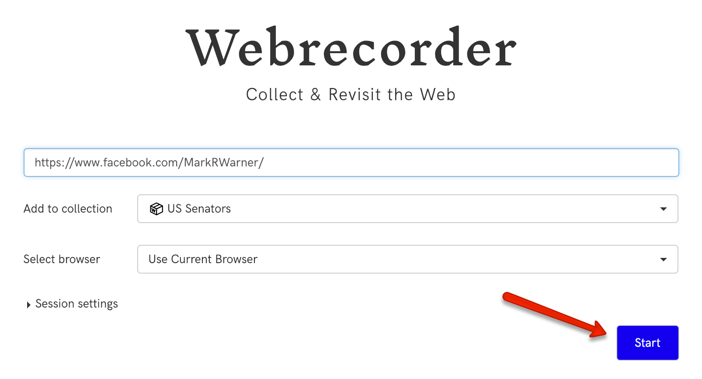

# Recording a Facebook page with WebRecorder & downloading the WARC file

## Recording

See [this guide](https://guide.webrecorder.io/) for additional information on how to use WebRecorder.

1. Go to [WebRecorder](https://webrecorder.io), create a collection, enter the URL of the Facebook page, and start recording.

The Facebook page will open in WebRecorder's virtual browser.

2. Wait a few moments. When prompted, log into Facebook.

3. Select "Posts" and start scrolling through the posts.

Alternatively, use WebRecorder's autoscroll feature.

4. When you are done, stop recording.

If you want to record additional Facebook pages, record each in a separate session.

## Downloading

1. From the Collection Index page for your collection, select "Manage Sessions".

2. Click the download button for the session.

